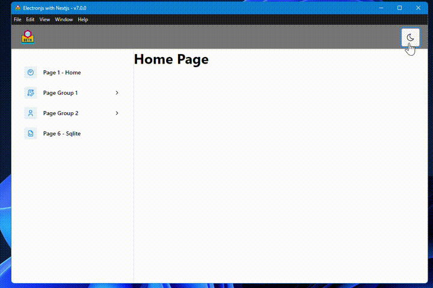

# Electron + Typescript + Next + Mantine UI + Sequelize(sqlite3)

<div align="center">
  
</div>

<div align="center">
   <!--  -->
   <!--  -->
   
   <!--  -->
   
   
   
   
</div>

---

## Use

```sh
git clone https://github.com/saulotarsobc/electron-next-ts.git;
cd electron-next-ts;
npm install;
npm run dev;
```

## Help

- [Electronjs - documentation](https://www.electronjs.org/pt/docs/latest/)
- [What is CODE SIGNING | Importance of code sign | Code sing in electron js](https://youtu.be/a27EtDuUGYg)
- [Electron Builder Tutorial: How to Sign Your Electron App's Code](https://youtu.be/WnipZaYslRc)
- [Electron AutoUpdater Tutorial: How to Ship Updates to Your Electron App on Mac](https://youtu.be/CtuV6hho2U0)
- [Electron Mini Tutorials](https://youtube.com/playlist?list=PL_2VhOvlMk4XLzvGgqbmjF9PkVgUGMDcJ&si=7r5qeWiby_1d6vCr)
- [Hacking Electron Applications](https://youtu.be/jkJWA_CWrQs)
- [Any Linux Target](https://www.electron.build/configuration/linux)

## NPM Commands

- **dev:** Builds the backend and then runs the application in development mode using Electron.

  ```json
  "dev": "npm run build:backend && electron . --dev"
  ```

  - `npm run build:backend`: Compiles the backend code using TypeScript.
  - `electron . --dev`: Starts the Electron application in development mode.

- **prebuild:** Cleans up the `build` and `dist` directories before building the project.

  ```json
  "prebuild": "rimraf build && rimraf dist"
  ```

  - `rimraf build`: Removes the `build` directory.
  - `rimraf dist`: Removes the `dist` directory.

- **build:** Builds both the frontend and the backend.

  ```json
  "build": "npm run build:frontend && npm run build:backend"
  ```

  - `npm run build:frontend`: Builds the frontend using Next.js.
  - `npm run build:backend`: Compiles the backend code using TypeScript.

- **build:frontend:** Compiles the frontend using Next.js.

  ```json
  "build:frontend": "next build frontend"
  ```

- **build:backend:** Compiles the backend using TypeScript.

  ```json
  "build:backend": "tsc -p backend"
  ```

- **postinstall:** Installs the application's dependencies using `electron-builder`.

  ```json
  "postinstall": "electron-builder install-app-deps"
  ```

- **dist:** Builds the project and then creates distribution artifacts using `electron-builder`.
  ```json
  "dist": "npm run build && electron-builder"
  ```
