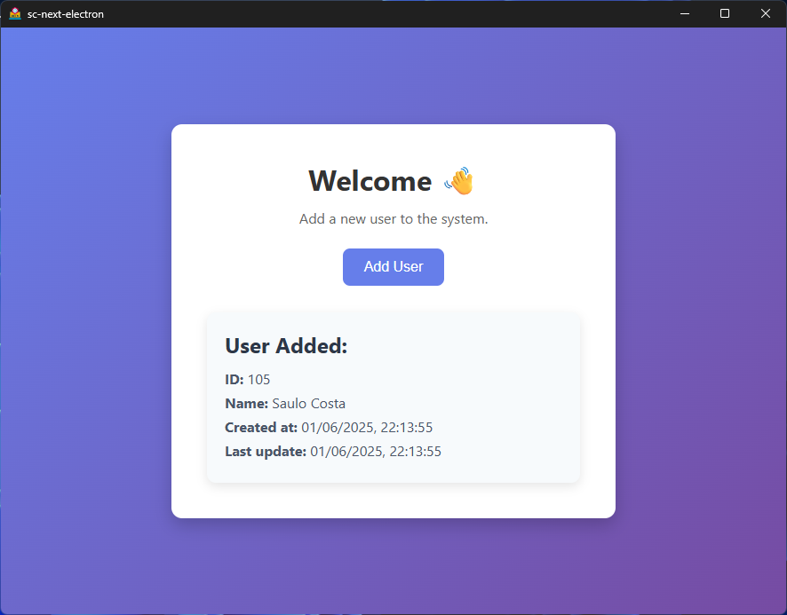

# electronjs-with-nextjs

<div align="center">
  
  
</div>

<div align="center">
  
  
  
  
  
  
  
</div>

---

<div align="center">
  
  
  
  
  
  
  
</div>

---

<div align="center">
  
</div>

---

## Use

```sh
git clone https://github.com/saulotarsobc/electron-next-ts.git;
cd electron-next-ts;
npm install;
npm run dev;
```

## Help

- [Electronjs - documentation](https://www.electronjs.org/pt/docs/latest/)
- [Any Linux Target](https://www.electron.build/linux)

## NPM Commands

- `npm run dev`: Run Electron with development build.
  - `npm run build:backend`: Build backend with TypeScript.
  - `electron . --dev`: Run Electron with development build.
- `npm run prebuild`: Remove build and dist directories.
- `npm run build`: Build frontend and backend.
  - `npm run build:frontend`: Build frontend with Next.js.
  - `npm run build:backend`: Build backend with TypeScript.
- `npm run postinstall`: Install dependencies for Electron.
- `npm run dist`: Build and make a distribution package with Electron Builder.

## Git Commands

### Release

```bash
#! bash
git tag "v$1"
git push origin --tags
```
