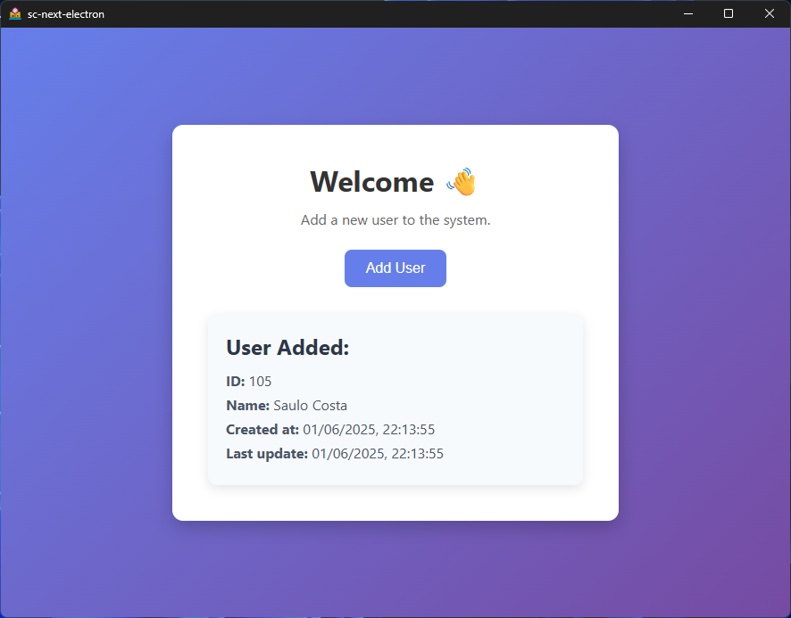

# SC - Electron and Next

> A template to build an ElectronJS app with NextJS

⚠️ See also [electron-with-vite](https://github.com/saulotarsobc/electron-with-vite)

---

<div align="center">
  
</div>

---

<div align="center">
  
  
</div>

<div align="center">
  
  
  
  
  
  
  
</div>

---

<!-- Badge Start -->
<div align="center">
 
 
 
 
 
 
 
</div>
<!-- Badge End -->

---

## Use

Requires Node.js 22.12 or newer and npm 11.

```sh
git clone https://github.com/saulotarsobc/electronjs-with-nextjs.git
cd electronjs-with-nextjs
npm ci
npm run dev
```

## Help

- [Electronjs - documentation](https://www.electronjs.org/pt/docs/latest/)
- [Any Linux Target](https://www.electron.build/linux)

## Scripts

- `dev`: Run Electron with development build.
- `build:backend`: Build backend with TypeScript.
- `clear`: Remove build and dist directories.
- `build`: Build frontend and backend.
- `build:frontend`: Build frontend with Next.js.
- `build:backend`: Build backend with TypeScript.
- `postinstall`: Rebuild native dependencies for Electron.
- `dist`: Build and make a distribution package with Electron Builder.

## electron-builder Configutarion to this project

```json
...
 "build": {
    "appId": "br.com.electron.next",
    "productName": "SC - Electron and Next",
    "files": [
      "dist"
    ],
    "directories": {
      "output": "out"
    },
    "win": {
      "target": [
        "nsis"
      ],
      "artifactName": "${name}-${version}-windows-${arch}.${ext}"
    },
    "mac": {
      "target": "dmg",
      "signIgnore": null,
      "artifactName": "${productName}-Setup-${version}.${ext}"
    },
    "linux": {
      "target": [
        "AppImage",
        "deb"
      ],
      "artifactName": "${name}-${version}-linux-${arch}.${ext}"
    }
  }
...
```

## Git Commands

### Release

```bash
#! bash
git tag "v$1"
git push origin --tags
```
